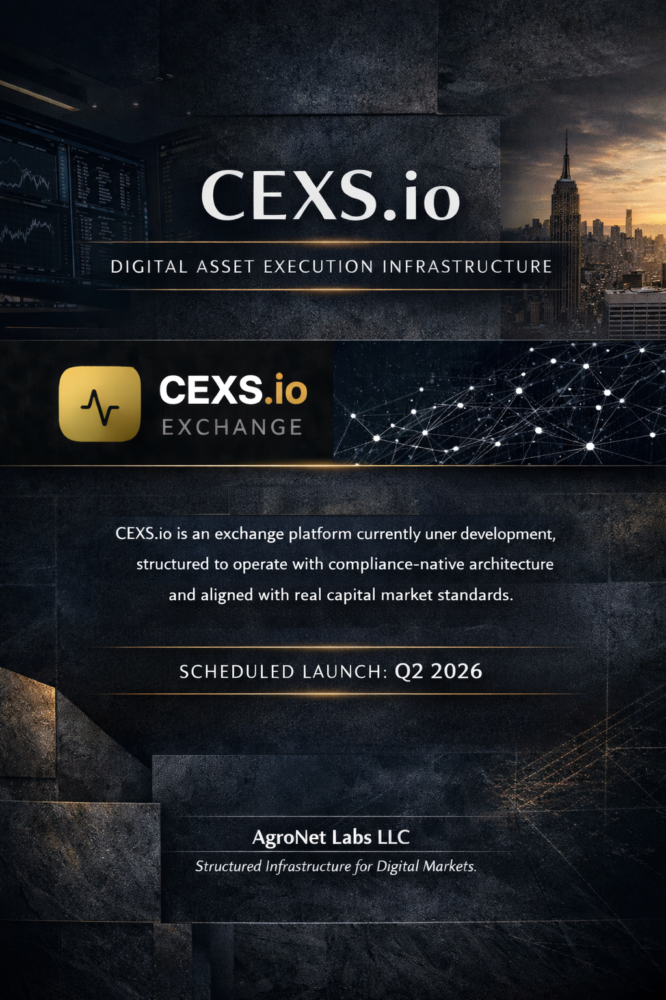

[](https://openclaw.ai)
# CEXS.io — Institutional Digital Asset Exchange & Settlement Infrastructure

[](https://github.com/agronetlabs/ATF-AI)
[](https://github.com/agronetlabs/erc-8040-ecosystem)
[]()
[]()
[]()

---

<div align="center">
  
</div>

---

## What is CEXS.io?

CEXS.io is an **institutional-grade digital asset exchange and settlement infrastructure** — built natively on the [ATF-AI Autonomous Trust Framework](https://github.com/agronetlabs/ATF-AI).

> Not just another exchange. A compliance-native settlement layer for the next generation of regulated digital assets.

---

## Core Architecture

```
┌─────────────────────────────────────────────────────┐
│                    CEXS.io PWA                       │
│         Installable — No App Store Required          │
└────────────────────┬────────────────────────────────┘
                     │
┌────────────────────▼────────────────────────────────┐
│              Settlement Engine (Rust/Axum)           │
│   ┌──────────────┬──────────────┬─────────────────┐ │
│   │ TRON Network │ Ethereum     │ CCTP Cross-Chain │ │
│   └──────────────┴──────────────┴─────────────────┘ │
│              ATF-AI Audit Hash on every tx           │
└────────────────────┬────────────────────────────────┘
                     │
┌────────────────────▼────────────────────────────────┐
│           ATF-AI Compliance Layer                    │
│   Zero-trust · Cryptographic Provenance · Auditable  │
└────────────────────┬────────────────────────────────┘
                     │
┌────────────────────▼────────────────────────────────┐
│           ERC-8040 Token Standard                    │
│   ESG Scoring · SFDR Articles 6/8/9 · ISO 20022     │
│   EU Taxonomy · SWIFT Bridge · Multi-chain           │
└─────────────────────────────────────────────────────┘
```

---

## Key Features

### 🏛️ Institutional-Grade
- Event-sourced architecture with complete audit trail
- Double-entry accounting — cryptographically verifiable
- KYC/AML compliance ready
- Full regulatory reporting capabilities

### âš¡ Real-Time Settlement
- Multi-chain settlement: Ethereum, TRON, Base, Arbitrum
- Cross-Chain Transfer Protocol (CCTP) by Circle
- Stablecoin native: USDT, USDC
- ATF-AI audit hash embedded in every transaction

### 🌱 ESG & Compliance Native
- ERC-8040 token standard — first ESG token with SWIFT ISO 20022 support
- SFDR Article 6/8/9 automatic classification
- EU Taxonomy alignment calculation
- Carbon intensity estimation

### 📱 PWA — No Gatekeepers
- Installable on iOS and Android directly from browser
- No App Store. No Play Store. No intermediaries.
- Full native experience — offline capability, push notifications

---

## Tech Stack

| Layer | Technology |
|-------|-----------|
| Frontend | React 18 + TypeScript + Vite + Tailwind |
| Backend | Rust + Axum (high-performance async) |
| Database | PostgreSQL + SQLx (double-entry ledger) |
| Blockchain | ethers-rs (Ethereum) + TRON + CCTP |
| Compliance | ATF-AI Protocol + ERC-8040 |
| Infrastructure | Supabase + Cloudflare |

---

## ATF-AI Integration

Every settlement operation on CEXS.io generates an **ATF-AI Audit Hash**:

```
ATF-AI-AUDIT-{SHA256(token_id + stablecoin + amount + wallet_from + wallet_to)}
```

This hash is traceable back to the full ATF-AI provenance chain — connecting every on-chain settlement to its compliance attestation. Any auditor can verify the complete chain from SWIFT message to on-chain transaction.

---

## Ecosystem

| Project | Description | Link |
|---------|-------------|------|
| **ATF-AI** | Autonomous Trust Framework — governance protocol | [github.com/agronetlabs/ATF-AI](https://github.com/agronetlabs/ATF-AI) |
| **ERC-8040** | ESG Token Standard + SWIFT ISO 20022 bridge | [github.com/agronetlabs/erc-8040-ecosystem](https://github.com/agronetlabs/erc-8040-ecosystem) |
| **AgroNet Backend** | Settlement engine (Rust/Axum) | [github.com/agronetlabs/backend](https://github.com/agronetlabs/backend) |
| **AgroNet Labs** | Company | [agronet.ai](https://agronet.ai) |

---

## Roadmap

- [x] ATF-AI Protocol — open spec published
- [x] ERC-8040 — first ESG token with SWIFT ISO 20022 native support
- [x] Settlement engine — Rust/Axum, multi-chain, live
- [x] PWA — installable on iOS and Android
- [x] KYC/AML compliance architecture
- [ ] **Q2 2026 — Public launch**
- [ ] Institutional onboarding
- [ ] Regulated markets integration

---

## Institutional Access

For institutional inquiries, partnerships, or investor relations:

🌐 [cexs.io](https://cexs.io)
📩 contact@cexs.io
📅 [Schedule a demo](https://calendly.com/admin-agronet/30min)

---

> This repository is the public institutional showcase of CEXS.io.
> The production codebase is maintained privately under AgroNet Labs LLC governance.

**AgroNet Labs LLC** | San Francisco | [agronet.ai](https://agronet.ai)

